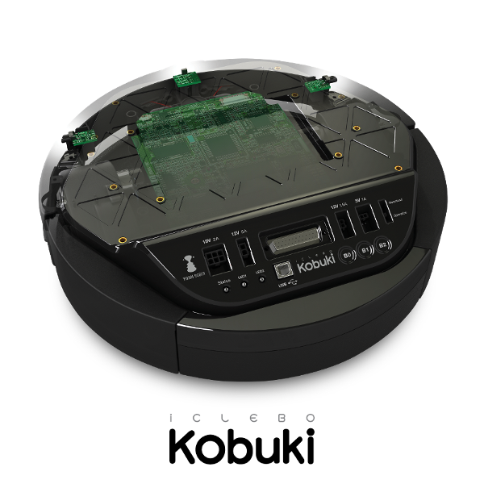

Contents
========

.. toctree::
   :maxdepth: 1
   :caption: Kobuki

   about
   out_of_the_box
   software
   applications
   C++ API (Doxygen) <https://kobuki-base.github.io/kobuki_core/>

.. toctree::
   :maxdepth: 1
   :caption: Kobuki Resources

   anatomy
   conversions
   protocol
   firmware
   media

.. toctree::
   :maxdepth: 1
   :caption: Advanced Kobuki

   docking
   embedded_boards
   custom_drivers

.. toctree::
   :maxdepth: 1
   :caption: Reference

   changelog
   glossary
